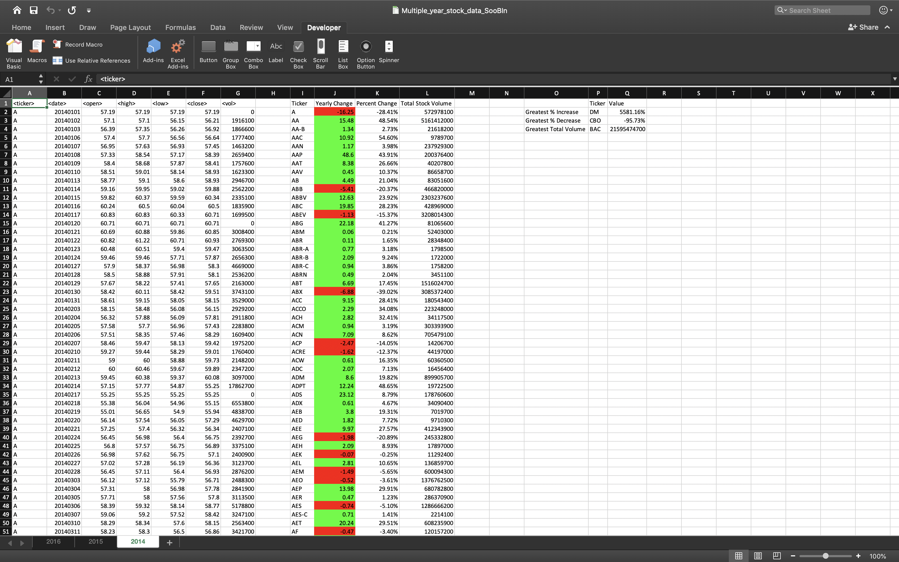
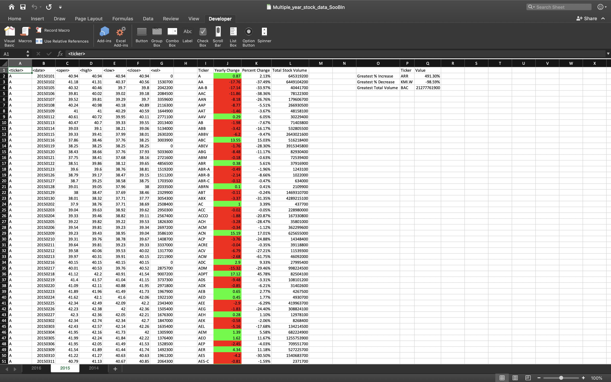
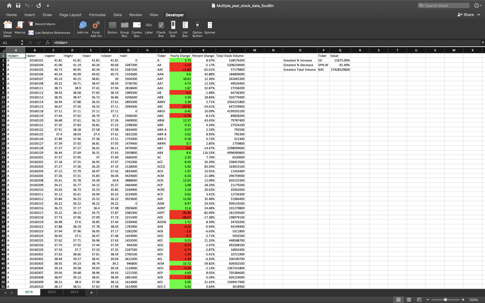

# The VBA of Wall Street

Using Microsoft Visual Basics, stock market data are analyzed in the way in which that:
* Yearly change from opening price at the beginnin of a given year to the closing price at the end of the same year is calculated;
* Percent change from opening price at the beginning of a given year to the closing price at the end of the same year is calculated;
* The total stock volume of each stock is calculated; and
* The greatest percent increase, greatest percent decrease and greatest total volume are calculated.

For codes, refer to `WallStreet_vba_SooBin.vbs` and `Resources/Multiple_year_stock_data_SooBin.xlsx`. The following screenshots show the results of running the VBA code.

